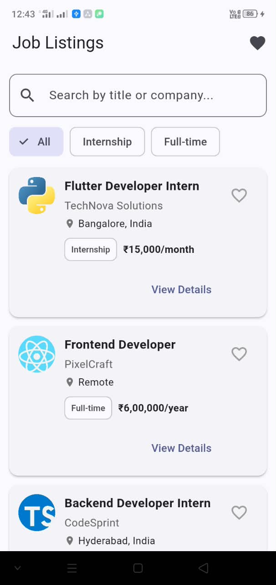
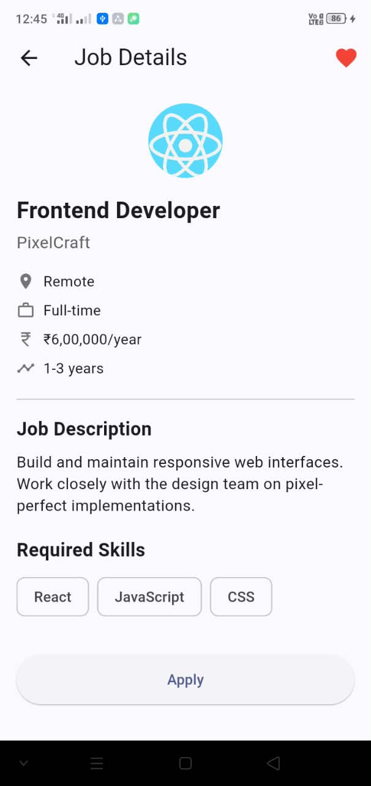
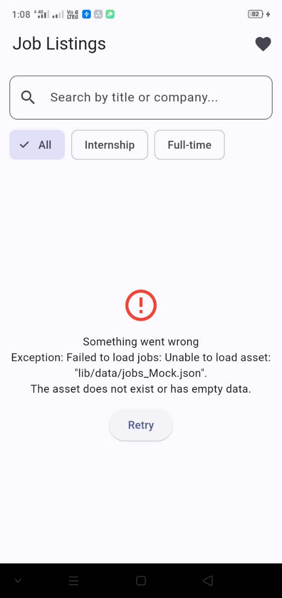
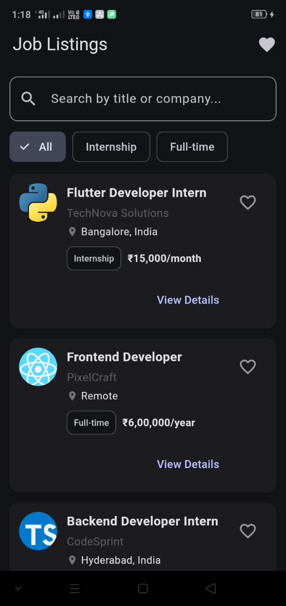
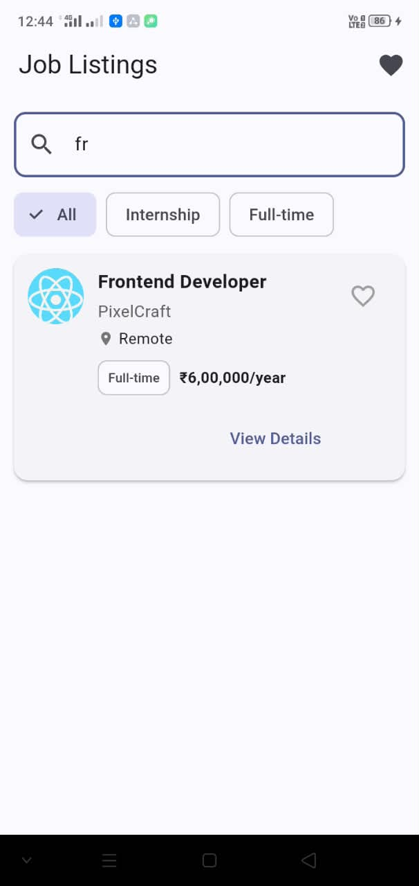

# Job Listing App

## Overview
A Flutter app to browse, search, filter, and save job listings, built as a take-home assignment.

## Setup Instructions
1. Clone the repo
2. Run `flutter pub get`
3. Run `flutter run`

## Screenshots

| Home | Job Details | Favorites |
|------|-------------|-----------|
|  |  |  |

| Empty State | Error State | Dark Mode |
|-------------|-------------|-----------|
|  |  |  |

| Search | Apply Confirmation |
|--------|---------------------|
|  |  |

## Architecture
- State management: Provider (ChangeNotifier)
- Layered structure: models / services / providers / screens / widgets
- Mock data served locally via a JobService, structured so it can be swapped for a real API later

## Packages Used
- provider
- cached_network_image

## Assumptions / Limitations
- Job data is served from a local mock JSON file, not a live API
- Favorites are stored in-memory only (not persisted across app restarts)
- No authentication/login flow implemented, as not specified in the assignment